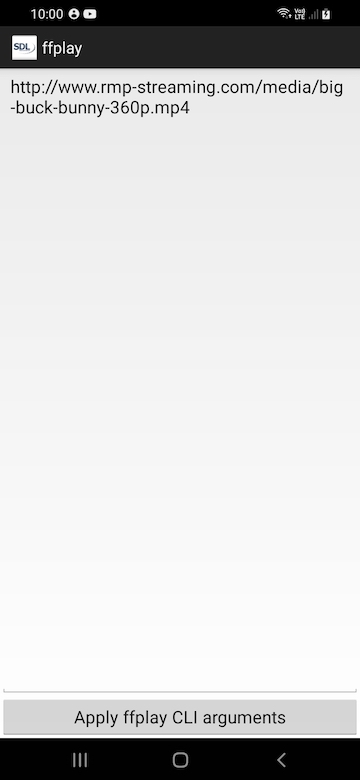

# ffplay
## ffplay from ffmpeg sources compiled for android

In order to fast build project it doesn't includes souces libs for ffmpeg and SDL2

All ffmpeg libs are ready to build from https://github.com/tanersener/mobile-ffmpeg.git

SDL2 build for Android is well documented at https://wiki.libsdl.org/Android

For playing videos, all happens here:
```
ffplay.c
cmdutils.c
```

Tested with RTSP and MP4 streaming.

SSL is not capable.




